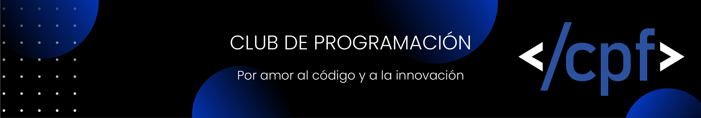

## 🚀 **Club de Programación FIUNA**  

Somos una comunidad de estudiantes y entusiastas de la tecnología apasionados por la programación y la innovación. Nuestro objetivo es **crear un espacio donde cualquiera pueda aprender, desarrollar proyectos y conectar con la industria tecnológica**. Más que un club, somos un ecosistema de aprendizaje y experimentación, donde la creatividad y el código se unen para resolver desafíos reales.  

### 🌍 **Nuestra Visión**  
💡 Convertirnos en un punto de referencia para el desarrollo de talento en tecnología dentro y fuera de FIUNA.  
🚀 Ser una incubadora de ideas y proyectos innovadores con impacto en la educación, la industria y la sociedad.  

### 🎯 **Nuestra Misión**  
📚 Fomentar el aprendizaje práctico y el pensamiento computacional a través de cursos, talleres y mentorías.  
🤝 Crear una comunidad donde los estudiantes puedan colaborar en proyectos reales y desarrollar habilidades clave para su futuro profesional.  
🌱 Apoyar la transformación digital en la FIUNA mediante soluciones tecnológicas diseñadas por y para estudiantes.  

### 🎓 **Lo que hacemos**  
✅ Organizamos **cursos y capacitaciones** en desarrollo de software, desde lo básico hasta tecnologías avanzadas.  
✅ Brindamos **apoyo académico y mentoría** en materias que requieren programación.  
✅ Desarrollamos **proyectos colaborativos**, incluyendo aplicaciones, plataformas web y herramientas para la comunidad estudiantil.  
✅ Participamos y organizamos **hackathons, desafíos de programación y meetups** para fomentar la creatividad y la resolución de problemas.  
✅ Conectamos a los estudiantes con **empresas, startups y profesionales** para impulsar oportunidades de crecimiento y empleabilidad.  

### 💻 **Áreas de enfoque**  
🔹 **Desarrollo Web & Móvil** → Aplicaciones, sitios web y plataformas interactivas.  
🔹 **Ciencia de Datos & IA** → Análisis, machine learning y automatización.  
🔹 **Ciberseguridad & Blockchain** → Protección de datos y tecnologías descentralizadas.  
🔹 **Desarrollo de Videojuegos** → Diseño, programación y motores gráficos.  
🔹 **Internet de las Cosas** → Integración de hardware y software para soluciones inteligentes.  

### 🔥 **¿Por qué unirte?**  
🚀 **Aprende con proyectos reales** → Más que teoría, trabajamos con aplicaciones prácticas.  
🌎 **Red de contactos** → Conoce a otros apasionados por la tecnología y expande tu red profesional.  
🎯 **Acceso a eventos exclusivos** → Talleres, hackathons, meetups y oportunidades de networking.  
💼 **Preparación para la industria** → Desarrolla habilidades clave para el mercado laboral.  
🎁 **Swags y perks** → Participa en eventos y gana premios, stickers y mucho más.  

<h3>Conectá con nosotros</h3>

### 📌 **¡Y lo mejor? Es gratis.**  
No necesitas experiencia previa ni pagar ninguna membresía. Solo necesitas ganas de aprender y colaborar. 🚀
